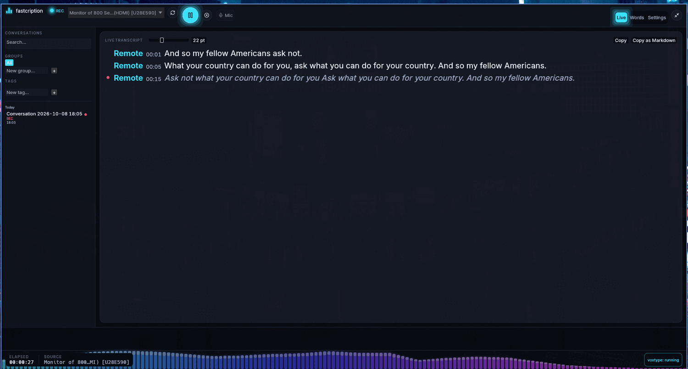
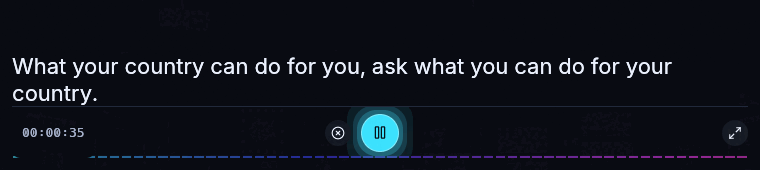
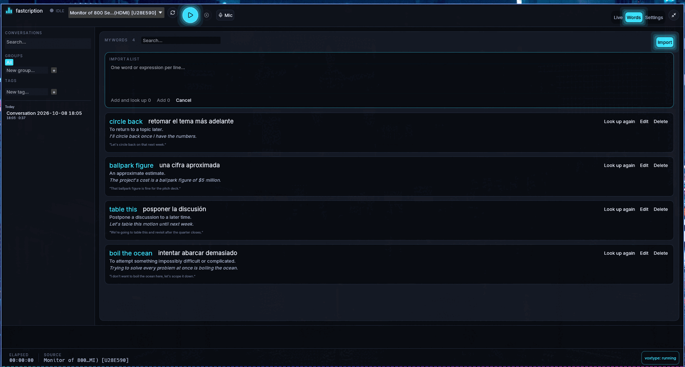
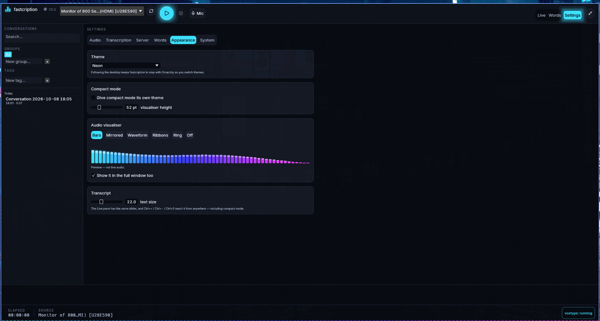

<div align="center">


# fastcription

**Read a conversation while it is still happening.**

Realtime transcription for the Linux desktop — a graphical frontend for
[voxtype](https://github.com/peteonrails/voxtype), written in Rust on
[fastframe](https://fastframe.dev)/egui.

[](https://github.com/alejandro-llanes/fastcription/actions/workflows/ci.yml)
[](https://github.com/alejandro-llanes/fastcription/releases/latest)
[](LICENSE)




</div>

---

## Why

If you follow a language better read than heard, a meeting goes past you faster
than you can keep up. You catch most of it, lose a sentence, and spend the next
two working out what you missed instead of listening.

fastcription captures **one** audio source you choose — the call, not your
music — transcribes it, and puts the words on screen about a second and a half
behind the speaker. Afterwards the transcript stays in a searchable library,
and the three expressions you had never met before are one keystroke from an
explanation.

Everything runs on your machine unless you point it somewhere yourself.

## What it does

### Follows the conversation, live

Words appear once two consecutive transcription passes agree on them, so the
text settles instead of flickering as you read it. The line still being spoken
is shown in italics, because its tail is still being revised.

### Shrinks onto the call

`Ctrl+M` turns the window into a caption strip — borderless, always on top,
floating over a fullscreened meeting. Start, pause and stop are on the strip;
it can wear a different theme from the main window, because a palette that is
pleasant to work in is not always the right thing to read captions off.

<div align="center">

</div>

### Explains what you did not understand

Select a word or an expression straight out of the transcript — drag across it,
or double-click — and press `Ctrl+D`. It checks your own vocabulary first and
asks a language model only for something new, then shows the meaning **in the
context of the line it was said in**, the translation, and an example.

<div align="center">

</div>

The English meaning is always shown beside the translation on purpose: a small
model sometimes renders an idiom word for word, and the meaning is what catches
it. Both are editable. Lists can be pasted in with `Ctrl+I`.

### Looks like something

A spectrum of the audio — a real FFT, not a shape drawn from the volume — runs
behind the footer and across the caption strip, in six styles. The palette is
the app's own by default and can follow your desktop theme instead.

<div align="center">

</div>

### And the rest

- **One source, the one you chose** — a capture device, the monitor of an
  output sink, or a single application's audio stream.
- **Your microphone too**, optionally, as a second track, so the transcript has
  both halves of the conversation.
- **A library**: conversations named, grouped, tagged, and searchable by what
  was actually *said* — full-text, not just titles.
- **Export** to text, Markdown, JSON, SRT or WebVTT.
- **Imports past voxtype meetings** recorded by voxtype's own meeting mode.
- **A readiness checklist** that says exactly what is missing before you press
  Start, with the command to fix it on a button.

## Install

```sh
curl -fsSL https://raw.githubusercontent.com/alejandro-llanes/fastcription/master/install.sh | sh
```

Installs into `~/.local` — binary, menu entry and icon — verifies the download
against its published SHA-256, needs no root, and tells you what else is
missing. Prefer to read it first? It is [one file](install.sh), and
`FASTCRIPTION_VERSION`, `PREFIX`, `BIN_DIR` and `NO_DESKTOP` change what it
does.

You also need PipeWire or PulseAudio, and voxtype with a model:

```sh
voxtype setup --download
```

**[docs/INSTALL.md](docs/INSTALL.md)** walks through all of it, including the
optional GPU server and Ollama. [Build from source](docs/INSTALL.md#build-from-source)
if you would rather.

## Performance

Numbers measured on the development machine — an RTX 5070, `large-v3-turbo`,
encoding the 7-second window one pass of live captioning works on. This is the
single thing that decides whether realtime is possible:

| Transcription backend | Encode per pass | |
| --- | --- | --- |
| **CUDA** | **85 ms** | |
| CPU, 24 threads | 2,796 ms | 33× slower |
| CPU, 4 threads (the default) | 10,256 ms | 121× slower |

A pass has about a second. On a CPU it does not finish in time, so the captions
fall behind and keep falling — which is why the app warns you when it detects a
CPU-only engine rather than letting you discover it mid-meeting.

With a GPU doing the work, end to end:

| | |
| --- | --- |
| Words on screen behind the speaker | ~1.5–2 s |
| Audio delivered to the pipeline | every 43 ms (median), 86 ms worst case |
| Spectrum analysis | 512-point FFT, 20×/s, on the capture thread |
| Word lookup, `gemma3:4b` | 0.41 s |
| VRAM, whisper + the lookup model | 6.0 GB |

The word-lookup model was chosen by measuring three candidates against the
exact request the app sends — two of them were faster and produced Spanish that
would have misled a reader. The table is in
[docs/INSTALL.md](docs/INSTALL.md#which-model).

## How it works

Audio is captured with `parec` at 16 kHz mono and handed over every 50 ms.
About once a second the sentence currently being spoken is re-transcribed
**from its start** with `voxtype transcribe`, and a word is published once two
consecutive passes agree on it — LocalAgreement-2. That is what puts text on
screen quickly without it rewriting itself under your eyes.

Each sentence is written to SQLite the moment it is confirmed, so a crash costs
one sentence rather than the meeting. The interface never waits on the network
or the disk: transcription, lookups and the store all run on their own threads.

```
parec ──► capture thread ──┬──► FFT ──► spectrum (20 Hz)
                           └──► streaming transcriber ──► voxtype / whisper server
                                        │
                                        └──► SQLite ──► the window
```

[docs/ARCHITECTURE.md](docs/ARCHITECTURE.md) has the design decisions, what was
measured to reach them, and which voxtype interfaces are relied on.

## Keyboard

| Key | |
| --- | --- |
| `Ctrl+R` | Start, or resume |
| `Ctrl+Space` | Pause / resume |
| `Ctrl+.` | Stop |
| `Ctrl+M` | Compact mode (`Esc` comes back) |
| `Ctrl+D` | Look up the words selected in the transcript |
| `Ctrl+I` | Import a list of words |
| `Ctrl+,` | Settings |
| `Ctrl+=` · `Ctrl+-` · `Ctrl+0` | Transcript text larger, smaller, back to 22 pt |

None of them fire while a text field has the keyboard.

## Documentation

| | |
| --- | --- |
| [INSTALL.md](docs/INSTALL.md) | fastcription, voxtype, whisper on a GPU, Ollama |
| [USER_GUIDE.md](docs/USER_GUIDE.md) | Every feature in the order you meet it, and every message it can show |
| [CONFIGURATION.md](docs/CONFIGURATION.md) | Every setting, its default and range; every file read or written |
| [SERVER.md](docs/SERVER.md) | Running the model on another computer |
| [OVERLAY.md](docs/OVERLAY.md) | Compact mode on Hyprland, sway and river |
| [ARCHITECTURE.md](docs/ARCHITECTURE.md) | The design, and what was measured |

## Status

Early but real: 362 tests, `clippy -D warnings` clean, and used daily by its
author. Linux and x86-64 only for now. Verified against voxtype 1.0.1.

## License

MIT — see [LICENSE](LICENSE).
